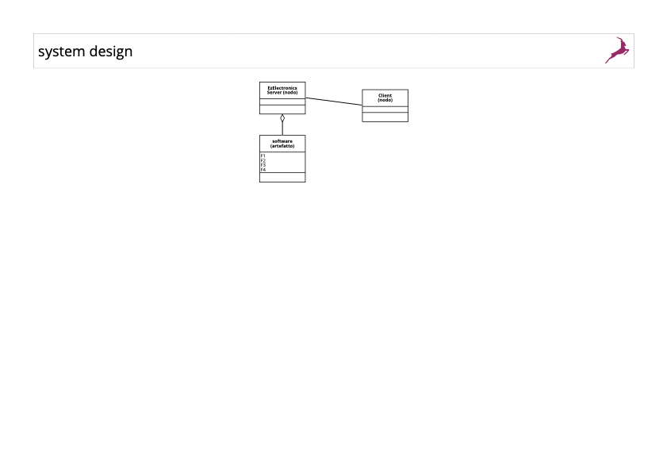
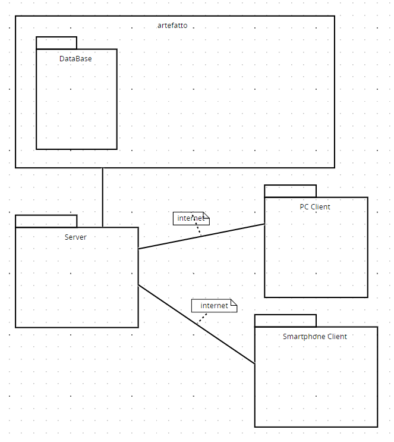

# Requirements Document - current EZElectronics

Date:

Version: V1 - description of EZElectronics in CURRENT form (as received by teachers)

| Version number | Change            |
| :------------: | :---------------: |
|        V1      | versione iniziale |

# Contents

- [Requirements Document - current EZElectronics](#requirements-document---current-ezelectronics)
- [Contents](#contents)
- [Informal description](#informal-description)
- [Stakeholders](#stakeholders)
- [Context Diagram and interfaces](#context-diagram-and-interfaces)
  - [Context Diagram](#context-diagram)
  - [Interfaces](#interfaces)
- [Stories and personas](#stories-and-personas)
- [Functional and non functional requirements](#functional-and-non-functional-requirements)
  - [Functional Requirements](#functional-requirements)
  - [Non Functional Requirements](#non-functional-requirements)
- [Use case diagram and use cases](#use-case-diagram-and-use-cases)
  - [Use case diagram](#use-case-diagram)
    - [Use case 1, UC1](#use-case-1-uc1)
      - [Scenario 1.1](#scenario-11)
      - [Scenario 1.2](#scenario-12)
      - [Scenario 1.3](#scenario-13)
    - [Use case 2, UC2](#use-case-2-uc2)
    - [Use case 3, UC3](#use-case-x-uc3)
      - [Scenario 3.1](#scenario-31)
- [Glossary](#glossary)
- [System Design](#system-design)
- [Deployment Diagram](#deployment-diagram)

# Informal description

EZElectronics (read EaSy Electronics) is a software application designed to help managers of electronics stores to manage their products and offer them to customers through a dedicated website. Managers can assess the available products, record new ones, and confirm purchases. Customers can see available products, add them to a cart and see the history of their past purchases.

# Stakeholders

| Stakeholder name | Description |
| :--------------: | :---------: |
| Manager/Admin | Gestore del negozio di elettronica. Gestisce l'inserzione e la modifica dei prodotti e le operazioni di vendita. |
| Cliente | Cliente che visita il sito web. Visualizza i prodotti, gestisce il carrello ed acquista. |
<!-- | Impiegato | Impiegato del negozio. Gestisce le operazioni di gestione dei prodotti (poteri limitati rispetto al manager). | -->
# Context Diagram and interfaces

## Context Diagram

\<Define here Context diagram using UML use case diagram>

\<actors are a subset of stakeholders>

## Interfaces

\<describe here each interface in the context diagram>

\<GUIs will be described graphically in a separate document>

|   Actor   | Logical Interface | Physical Interface |
| :-------: | :---------------: | :----------------: |
| Manager | Interfaccia di gestione completa | Interfaccia Web |
| Cliente | Interfaccia di navigazione | Interfaccia Web |
<!-- | Impiegato | Interfaccia di gestione limitata | Interfaccia Web | -->

# Stories and personas

\<A Persona is a realistic impersonation of an actor. Define here a few personas and describe in plain text how a persona interacts with the system>

\<Persona is-an-instance-of actor>
### Manager
- Descrizione: Giovanni è il gestore del negozio di elettronica, si occupa della gestione del sito a partire dai servizi di hosting ed è responsabile della parte amministrativa. Inoltre, può accedere al sito per aggiungere, modificare ed eliminare prodotti.

- Obiettivi: Offrire e mantenere un servizio di qualità per i clienti e fornire un catalogo aggiornato.
<!--
### Impiegato
- Nome: Francesco 

- Descrizione: Impiegato alle dipendeze del manager.

- Obiettivi: Gestire al meglio il catalogo secondo le direttive del manager.
-->
### Cliente
- Descrizione: Cliente del negozio di elettronica.

- Obiettivi: acquistare prodotti in modo semplice.

\<stories will be formalized later as scenarios in use cases>

# Functional and non functional requirements

## Functional Requirements

\<In the form DO SOMETHING, or VERB NOUN, describe high level capabilities of the system>

\<they match to high level use cases>

|  ID   | Description |
| :---: | :---------: |
|  FR1  | Gestione del catalogo |
| FR1.1 | Aggiunta di un prodotto |
| FR1.2 | Modifica di un prodotto |
| FR1.3 | Eliminazione di un prodotto |
| FR2   | Navigazione |
| FR2.1 | Visualizzazione del catalogo |
| FR2.2 | Filtro prodotti per categoria |
| FR3   | Gestione del carrello |
| FR3.1 | Aggiunta prodotto al carrello |
| FR3.2 | Visualizzazione del carrello |
| FR3.3 | Modifca del carrello |
| FR3.4 | Conferma ordine |
| FR4   | Acquisto |
| FR5   | Autenticazione |
| FR5.1 | Login |
| FR5.2 | Logout |
| FR5.3 | Registrazione |
(da aggiungere per V": modifica utente)

## Non Functional Requirements

\<Describe constraints on functional requirements>

|   ID    | Type (efficiency, reliability, ..) | Description | Refers to |
| :-----: | :--------------------------------: | :---------: | :-------: |
|  NFR1   | Efficienza | Il sistema deve garantire un tempo di risposta di massimo un secondo. Deve garantire meno del 25% delle risorse di cpu. | FR2, FR3, FR4 |
|  NFR2   | Affidabilità | Gli utenti non devono riferire più di un bag al'anno a testa. Il sistema deve essere dispondibile per il 95% del tempo operativo. Il 100% degli errori nel modo corretto fornendo messaggi e codici specifici. | FR1, FR2, FR3, FR4 |
|  NFR3   | Sicurezza | Protezione dei dati sensibili degli utenti. Gestione delle transazioni | FR1, FR2, FR3, FR4 |
|  NFR4   | Usabilità | Gli utenti non devono imparare a usare l sito. Facilità d'uso: tempo d'apprendimento tendente a 0. Accessibilità: il sistema deve aderire al 100% degli standard web per l'accessibilità | FR1, FR2, FR3, FR4 |
|  NFR5   | Scalabilità | Gestione di un aumento del carico utente maggiore della media senza perdita di prestazioni. | FR2, FR3, FR4 |

# Use case diagram and use cases

## Use case diagram

\<define here UML Use case diagram UCD summarizing all use cases, and their relationships>

\<next describe here each use case in the UCD>

### Use case 1, UC1: Gestione dei prodotti

| Actors Involved  |  Manager                                                             |
| :--------------: | :------------------------------------------------------------------: |
|   Precondition   | Il manager è autenticato                                             |
|  Post condition  | L'aggiornamento è andato a buon fine (codice di risposta di update)  |
| Nominal Scenario | Il manager accede, visualizza i prodotti, modifica le informazioni dei prodotti esistenti oppure aggiunge o elimina prodotti. |
|     Variants     |                      nessuna variante                                |
|    Exceptions    | Se l'utente non è autorizzato all'accesso della pagine di gestione dei prodotti, viene mostrato un messaggio d'errore. |

##### Scenario 1.1: Modifica delle informazioni di un prodotto esistente

|  Scenario 1.1  |                                                                            |
| :------------: | :------------------------------------------------------------------------: |
|  Precondition  | Il manager è autenticato                                                   |
| Post condition | L'aggiornamento è andato a buon fine                                       |
|     Step#      |                                Description                                 |
|       1        | Accesso al pannello di amministrazione                                     |
|       2        | Visualizzazione dei prodotti                                               |
|       3        | Selezione del prodotto da modificare                                       |
|       4        | Modifica delle informazioni tramite form                                   |
|       5        | Conferma delle modifiche                                                   |

##### Scenario 1.2: Aggiunta di un nuovo prodotto
|  Scenario 1.2  |                                                                            |
| :------------: | :------------------------------------------------------------------------: |
|  Precondition  | Il manager è autenticato                                                   |
| Post condition | L'aggiunta è andato a buon fine                                            |
|     Step#      |                                Description                                 |
|       1        | Accesso al pannello di amministrazione                                     |
|       2        | Visualizzazione dei prodotti                                               |
|       3        | Selezione tasto per aggiungere un prodotto                                 |
|       4        | Inserimento delle informazioni tramite form                                |
|       5        | Conferma dell'inserimento                                                  |

##### Scenario 1.3: Aumento/Diminuzoine quantità di un prodotto
|  Scenario 1.3  |                                                                            |
| :------------: | :------------------------------------------------------------------------: |
|  Precondition  | Il manager è autenticato                                                   |
| Post condition | L'aumento è andato a buon fine                                             |
|     Step#      |                                Description                                 |
|       1        | Accesso al pannello di amministrazione                                     |
|       2        | Visualizzazione dei prodotti                                               |
|       3        | Selezione tasto per modificare la quantità di un prodotto                  |
|       5        | Conferma della quantità                                                    |

##### Scenario 1.4: Eliminazione di un prodotto
|  Scenario 1.4  |                                                                            |
| :------------: | :------------------------------------------------------------------------: |
|  Precondition  | Il manager è autenticato                                                   |
| Post condition | L'eliminazione è andata a buon fine                                        |
=======
| Post condition | L'eliminazione è andato a buon fine                                        |
|     Step#      |                                Description                                 |
|       1        | Accesso al pannello di amministrazione                                     |
|       2        | Visualizzazione dei prodotti                                               |
|       3        | Selezione del prodotto da eliminare                                        |
|       4        | Conferma dell'eliminazione                                                 |

### Use case 2, UC2: Gestione del carrello
| Actors Involved  |   Cliente                                                            |
| :--------------: | :------------------------------------------------------------------: |
|   Precondition   | Il cliente è autenticato                                             |
|  Post condition  | Aggiunta o rimozione articoli dal carrello avvenuta correttamente    |
| Nominal Scenario | Il cliente accede al suo carrello, visualizza gli articoli, aggiunge/rimuove, il sistema aggiorna |
|     Variants     | Il cliente modifica della quantità di un prodotto / svuota il carrello |
|    Exceptions    | Se il cliente non è autenticato viene mostrato un messaggio d'errore |

##### Scenario 2.1: Aggiunta di un articolo al carrello
|  Scenario 2.1  |                                                                            |
| :------------: | :------------------------------------------------------------------------: |
|  Precondition  | Il cliente è autenticato                                                   |
| Post condition | L'aggiunta è andata a buon fine                                            |
|     Step#      |                                Description                                 |
|       1        | Accesso al sito                                                            |
|       2        | Visualizzazione degli articoli                                             |
|       3        | Selezione tasto per aggiungere un prodotto al carrello                     |
|       4        | Conferma dell'inserimento                                                  |

##### Scenario 2.2: Aumentare quantità di un articolo al carrello
|  Scenario 2.2  |                                                                            |
| :------------: | :------------------------------------------------------------------------: |
|  Precondition  | Il cliente è autenticato, l'articolo è già nel carrello                    |
| Post condition | L'aggiunta è andato a buon fine                                            |
|     Step#      |                                Description                                 |
|       1        | Accesso al sito                                                            |
|       2        | Visualizzazione degli articoli                                             |
|       3        | Selezione tasto per aumentare la quantità del prodotto nel carrello        |
|       4        | Conferma dell'aumento                                                      |

##### Scenario 2.3: Rimozione di un articolo dal carrelloo
|  Scenario 2.3  |                                                                            |
| :------------: | :------------------------------------------------------------------------: |
|  Precondition  | Il cliente è autenticato                                                   |
| Post condition |  La rimozione è andata a buon fine                                         |
|     Step#      |                                Description                                 |
|       1        | Accesso alla sezione del carrello del sito                                 |
|       2        | Visualizzazione dei prodotti                                               |
|       3        | Selezione del prodotto da rimuovere dal carrello                           |
|       4        | Conferma della rimozione                                                   |

### Use case 3, UC3: Login 
| Actors Involved  |   Cliente                                                            |
| :--------------: | :------------------------------------------------------------------: |
|   Precondition   | Il cliente non è autenticato                                         |
|  Post condition  | Il cliente è autenticato                                             |
| Nominal Scenario | Il cliente accede alla sua pagina personale                          |
|     Variants     | Il cliente è già autenticao, credenzili errate                       |
|    Exceptions    | Se il cliente non è autenticato viene mostrato un messaggio d'errore |

##### Scenario 3.1: 
|  Scenario 3.1  |                                                                            |
| :------------: | :------------------------------------------------------------------------: |
|  Precondition  | Il cliente non è autenticato                                               |
| Post condition | Il cliente è autenticato                                                   |
|     Step#      |                                Description                                 |
|       1        | Selezione del pulsante login                                               |
|       2        | Compilazione del form di accesso                                           |
|       3        | Selezione pulsante Accedi                                                  |

##### Scenario 3.2: 
|  Scenario 3.2  |                                                                            |
| :------------: | :------------------------------------------------------------------------: |
|  Precondition  | Il cliente non è autenticato                                               |
| Post condition | Il cliente è autenticato                                                   |
|     Step#      |                                Description                                 |
|       1        | Selezione del pulsante login                                               |
|       2        | Compilazione del form di accesso                                           |
|       3        | Selezione pulsante Accedi                                                  |
|       4        | Warning                                                                    |

### Use case 4, UC3: Registrazione
| Actors Involved  |   Cliente                                                            |
| :--------------: | :------------------------------------------------------------------: |
|   Precondition   | Il cliente non è autenticato                                         |
|  Post condition  | Il cliente è autenticato                                             |
| Nominal Scenario | Il cliente accede o crea la sua pagina personale                     |
|     Variants     | Email già registrata                                                 |
|    Exceptions    | Se il cliente non è autenticato viene mostrato un messaggio d'errore |

##### Scenario 4.1: 
|  Scenario 4.1  |                                                                            |
| :------------: | :------------------------------------------------------------------------: |
|  Precondition  | Il cliente non è registrato                                                |
| Post condition | Il cliente è autenticato                                                   |
|     Step#      |                                Description                                 |
|       1        | Selezione del pulsante login                                               |
|       2        | Compilazione del form di accesso                                           |
|       3        | email già registrata                                                       |
|       4        | Compilazione form registrazione                                            |
|       5        | Selezione pulsante Registra                                                |

##### Scenario 4.2: 
|  Scenario 4.3  |                                                                            |
| :------------: | :------------------------------------------------------------------------: |
|  Precondition  | Il cliente non è registrato                                                |
| Post condition | Il cliente è autenticato                                                   |
|     Step#      |                                Description                                 |
|       1        | Selezione del pulsante login                                               |
|       2        | Compilazione del form di accesso                                           |
|       3        | Compilazione form registrazione                                            |
|       4        | email già registrata                                                       |
|       5        | Warning                                                                    |

# Glossary

\<use UML class diagram to define important terms, or concepts in the domain of the application, and their relationships>

\<concepts must be used consistently all over the document, ex in use cases, requirements etc>

- Manager: utente autorizzatto all'applicazione che gestisce i prodotti all'interno del sistema.
- Pannello di amministrazione: interfaccia dell'applicazione riservata al manager.
- Customer/Cliente: utente registrato nell'applicazione che può effettuare acquisti nel sistema.
- Prodotto: articolo visibile sul sito e dispondibile per l'acquisto.
- Carrello: contenitore di articoli da acquistare.
- Autenticazione: processo di verifica dell'identità dell'utente.
- Database dei prodotti: archivio di dati contenente informazioni relativi ai prodotti.
- Database degli utenti: archivio di dati contenente informazioni relative agli utenti.
- Database degli ordini: archivio di dati contenente informazioni relative agli acquisti, mette in relazione prodotti e utenti.
- Sito web dedicato: piattaforma online che ospita l'applicazione.

# System Design

# Deployment Diagram

